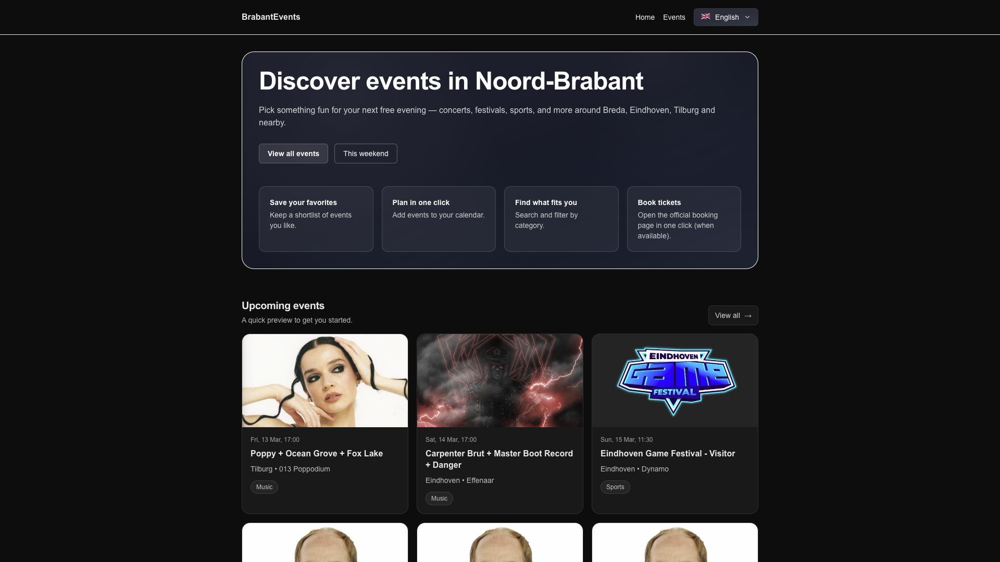
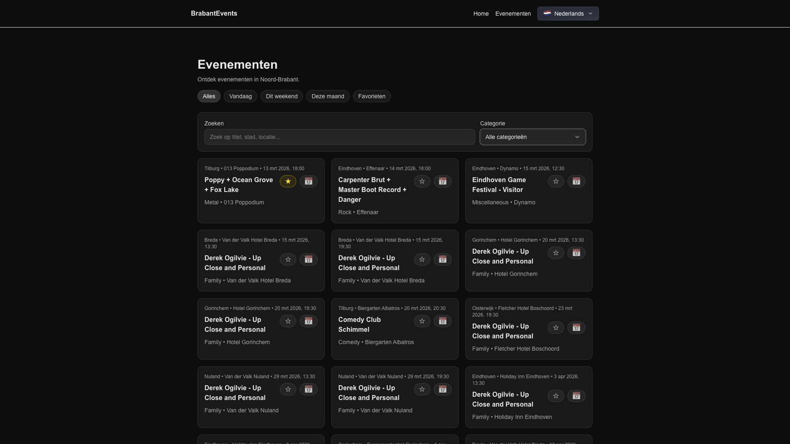
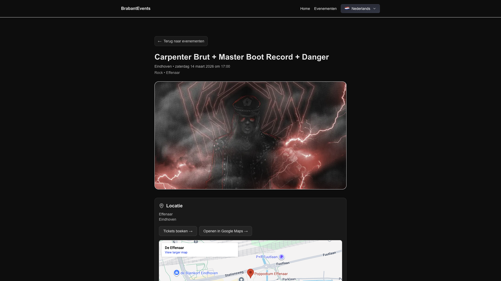

# BrabantEvents

BrabantEvents is an events discovery application for the Noord-Brabant region (NL), built with Next.js (App Router) and
a simple BFF layer on top of the Ticketmaster Discovery API.

The goal of this project is to demonstrate clean architecture, predictable routing, a polished user experience and
user-friendly features with real time data.

**Live demo:** https://brabant-events.vercel.app/

---

## Why this project

This project was built as a focused portfolio project to explore frontend best practices in a real-world context.

It shows:

- Clear App Router structure (server and client component separation)
- A simple BFF pattern using Next.js API routes
- Data normalization at the API boundary
- URL-driven state (filters, search, pagination)
- Locale-based routing (EN / NL)
- Basic SEO setup with structured data
- Production-ready deployment on Vercel

The scope is intentionally limited to keep the architecture clean and maintainable.

---

## Features

- Browse upcoming events in Noord-Brabant (geo + radius based)
- Filter by:
    - Today
    - This weekend
    - This month
- Search (URL-driven)
- Category filtering (URL-driven)
- Pagination
- Favorites (stored in `localStorage`)
- Event detail page with:
    - Venue, city, time
    - Embedded Google Maps view
    - “Open in Google Maps” link
    - Downloadable `.ics` calendar file
    - Book event tickets option
- Locale routing (`/en`, `/nl`)
- Basic SEO:
    - Metadata
    - robots.txt
    - sitemap.xml
    - JSON-LD for list and event pages

---

## Tech stack

- Next.js (App Router)
- React
- TypeScript
- Tailwind CSS
- Ticketmaster Discovery API
- Vercel deployment

---

## Architecture overview

### BFF pattern

Ticketmaster requests are handled through Next.js API routes:

- `/api/events`
- `/api/events/[id]`
- `/api/calendar`

The Ticketmaster API key remains server-side.

The UI consumes a normalized internal model (`AppEventPreview`) instead of raw Ticketmaster JSON.  
This keeps the frontend independent from the provider structure.

---

### URL-first state

Filters and pagination are represented in query parameters:

- `when`
- `q`
- `cat`
- `p`
- `fav`

Favorites are intentionally client-side only, because of the localStorage.

---

### i18n routing

Routes are locale-prefixed:

- `/en/events`
- `/nl/events`

The locale switcher saves the current state and query parameters.

---

## Run locally

### 1. Install dependencies

```bash
pnpm install
```

### 2. Create environment variables

Create a `.env.local` file in the project root:

```env
TICKETMASTER_API_KEY=9cA21o8nrr95wpU8HJg4Mq6pc5gwL26W
NEXT_PUBLIC_BASE_URL=http://localhost:3000
```

- `TICKETMASTER_API_KEY` is required for server-side API routes.
- `NEXT_PUBLIC_BASE_URL` is used to generate absolute URLs.

### 3. Start development server

```bash
pnpm dev
```

Open:

http://localhost:3000

---

## Production deployment

When deploying to Vercel:

I added the following environment variables:

- `TICKETMASTER_API_KEY`
- `NEXT_PUBLIC_BASE_URL`

After adding environment variables, I redeployed the last commit and.

---

## Scripts

```bash
pnpm dev      # run locally
pnpm build    # production build
pnpm start    # run production build
pnpm lint     # lint project
```

---

## Screenshots

### Home page



### Events list page



### Event detail page



---

Built by Franko Kulesevic ---
Frontend Developer (React / Next.js / Angular / TypeScript)